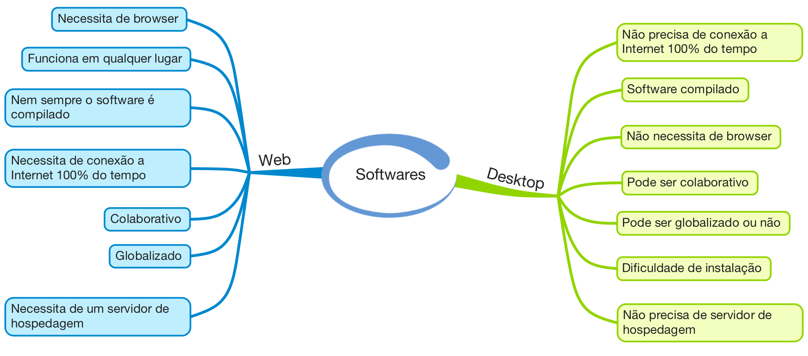

#Curso de Windows Forms Application

Antes da *Internet* aparecer e reinar no mundo, os *softwares* e programas era feitos em plataforma *desktop*, ou seja, eram feitos para executar localmente nos sistema operacionais Windows, Linux ou MacOS (nome alterado recentemente). Os *softwares* criados para Windows eram criados em linguagens antigas como VB, C, C++, Delphi, Pascal e outras. Agora as linguagens existentes estão focando mais em sistemas *web* e que funciona pelo *browser*.

Essa introdução foi apenas para falar que a *Internet* está tomando o mercado e muitos desenvolvedores estão esquecendo que existem outras plataformas. Com a plataforma *desktop* começaram a surgir outras plataformas como a de automobilismo, geladeira, TV e muitas outras que precisam funcionar localmente ao invés de utilizar o *browser* como interpretador. Esses *softwares* precisam ser instalados para funcionar colocando API e ferramentas de gerenciamento. 

Um exemplo disso são empresas que precisam que o *software* funcione mesmo que a *Internet* esteja fora ou que seja sem conexão. Outro exemplo é o Windows, Word, Excel, PowerPoint, Pages, Numbers, Keynote, Parallels, Virtual Box, iTunes, iBooks e vários outros. Estes são *softwares* criados para funcionar localmente e em alguns momentos precisam da conexão com a *Internet* para ler ou gravar algum dado, mas se não houver conexão, a funcionalidade principal irá funcionar sem qualquer problema. 

Imagine você precisar de *Internet* para escrever um texto no Microsoft Word. Não seria aplicável dia a dia, principalmente na realidade brasileira. Veja alguns itens falando sobre *Web* e *Desktop*.

Figura 1 - Softwares (Web e Desktop)

Na minha opinião, o desenvolvedor precisa entender também de desenvolvimento de *software* local, já que até o iPad, iPhone, tvOS e Apple Watch funciona localmente para depois se comunicar na *Internet*. 

Para ajudar os desenvolvedores, eu criei um curso grátis localizado no Youtube e no Channel9 da Microsoft chamado: **Windows Forms não morreu**. Acesse o link abaixo e veja mais informação sobre o curso:

1. [Youtube: Windows Forms não morreu](https://www.youtube.com/playlist?list=PLCOkAJmgh06riK1iWf-E3jHMFziKvACOD)
2. [Channel9: Windows Forms não morreu](https://channel9.msdn.com/Series/Windows-Forms)

Espero que possa te ajudar como me ajudou no momento que precisava. Fiz este artigo para que entenda a minha posição e ideia do que estamos vivendo hoje no mundo do desenvolvimento de *software*. Qualquer dúvida, pode entrar em contato comigo pelo site [www.mauriciojunior.org](https://www.mauriciojunior.org).
