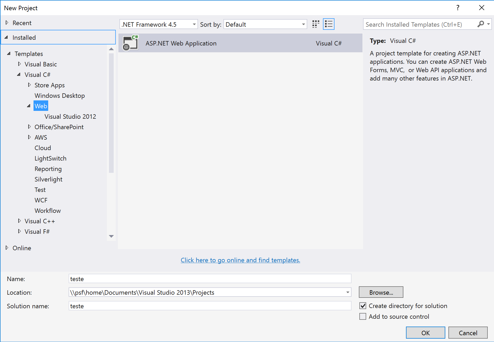
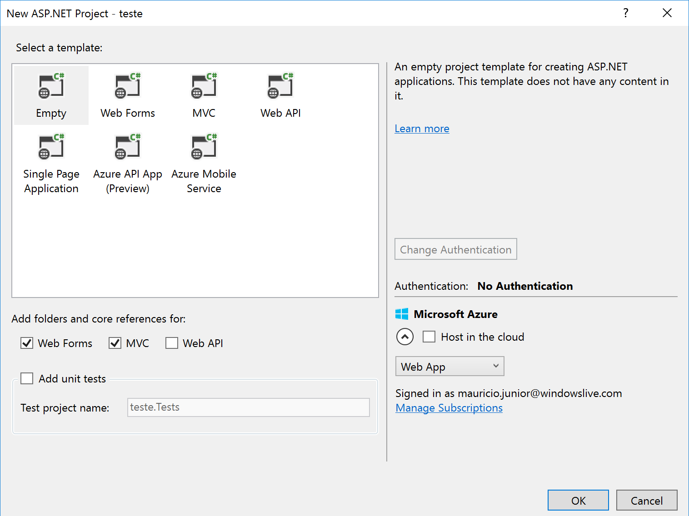
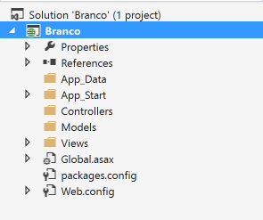
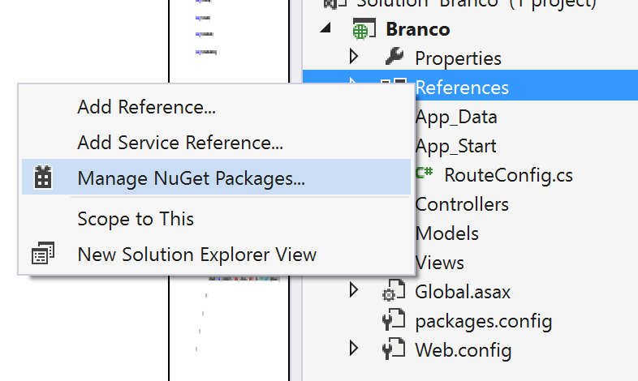
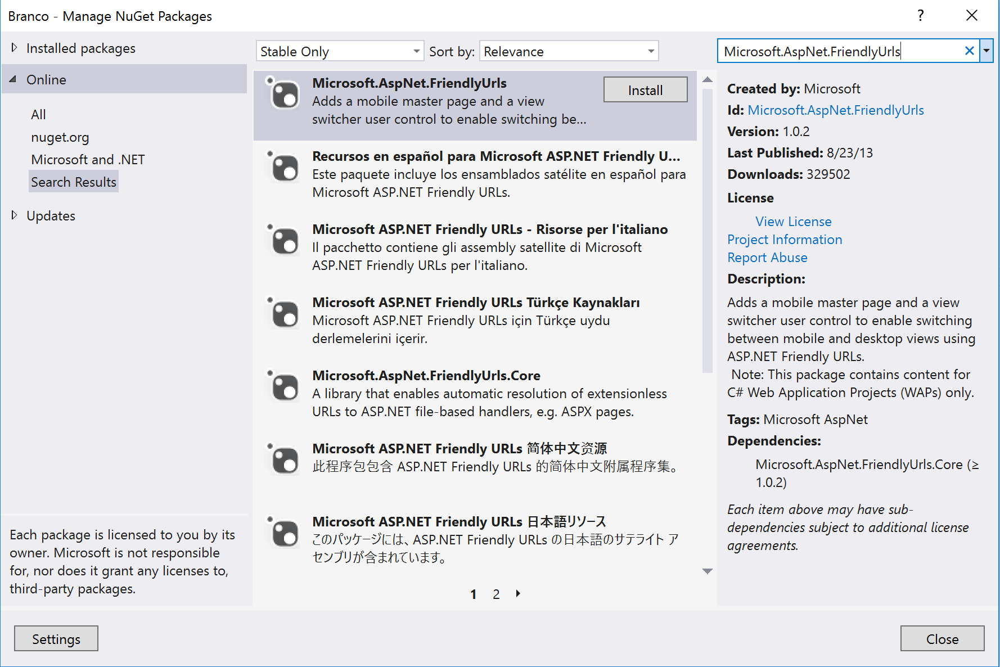
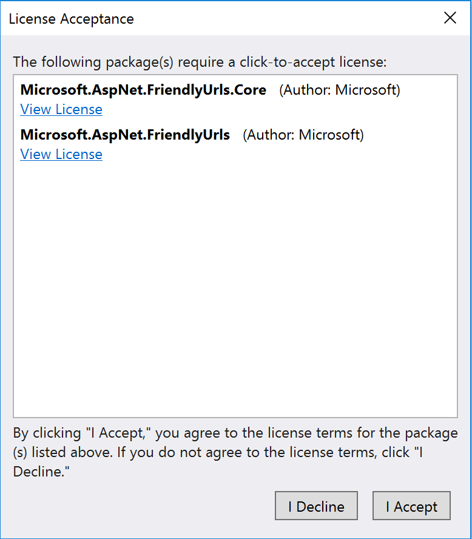

#Url amigável com framework

Olá pessoal, hoje eu vou falar e mostrar como trabalhar com Url amigável usando o *framework* da Microsoft chamada **Microsoft.AspNet.FriendlyUrls**. É importante dizer que a Microsoft desenvolveu a ferramenta de desenvolvimento muito boa e preparada para desenvolver para *Web*, *Desktop* e serviços. 

**Problema:**

Quando o desenvolvedor cria um projeto do tipo vazio (*empty*), alguns *frameworks* precisam ser importados ou adicionados para que funcione o que já estamos acostumados no momento de criar o projeto *web* usando *templates*. Exemplo: uma página chamada FORMULARIO.ASPX usando *templates* não mostra a extensão .ASPX, mostra só o nome da página. Quando você não tem o *framework* de Url amigável, a página só vai funcionar se colocar a extensão.

A figura 1 mostra a criação do projeto do tipo Web.

Figura 1 - Criando o projeto do tipo *Web*

A figura 2 mostra selecionado o *template* *Empty* e marcado a referência *Web Form* e *MVC*. Depois de clicar OK, o projeto é criado rapidamente mas apenas com os arquivos e referências básicas. As referências básicas não deixam as páginas funcionarem sem a extensão, em alguns casos nem a página *default.aspx* é chamada no início quando publicado no servidor. Veja a figura 2. 

Figura 2 - Escolhendo *template*

Depois de adicionar o *framework* criado pela Microsoft, todas as páginas com extensão funcionam ou transformam pelo *browser* sem a extensão. Dessa forma, acessando a página **default.aspx**, o *framework* de forma automática muda a página para **default** e dessa forma, o usuário acaba não sabendo da extensão da página e consequentemente a linguagem de *software* que foi desenvolvido.

Veja na figura 3 como ficou os arquivos do projeto criado de forma vazia. 

Figura 3 - Projeto vazio e sem *template*

O próximo passo é instalar o *framework* para deixar as páginas sem a necessidade de usar a extensão. Clique com o botão direito em cima de *References* e escolha o menu *Manager Nuget...*. A figura 4 mostra esse passo.

Figura 4 - Adicionando referência

A figura 5 já mostra outra tela para pesquisar o nome da referência específica. Você pode navegar ou pesquisar pelo nome. Ao lado direito existe o campo para pesquisar. Digitei o nome e a ferramenta completou o nome que eu queria e no final cliquei a tecla ENTER. Caso a ferramenta não complete, digite parte do nome e tecle ENTER. Ao encontrar a referência desejada, clique no botão *INSTALL* ao lado. Veja a figura 5.

Figura 5 - Buscando a referência no Nuget

Ao clicar no botão *INSTALL* uma solicitação aparece na tela.

Figura 6 - Solicitando autorização para instalação

Note que o autor é a Microsoft, na minha opinião, mais confiável do que qualquer outro. Quando terminar de instalar, acesse o arquivo RouteConfig.cs localizado dentro da pasta App_Start e coloque algumas linhas de código. Instalado, as três primeiras linhas de código são colocadas na instalação, é necessário colocar os outros comandos *IgnoreRoute* e *MapRoute* com a necessidade MVC. Veja o code 1.1.

`
	
	using System;
	using System.Collections.Generic;
	using System.Web;
	using System.Web.Routing;
	using Microsoft.AspNet.FriendlyUrls;
	using System.Web.Mvc;

	namespace Branco
	{
    public static class RouteConfig
    {
        public static void RegisterRoutes(RouteCollection routes)
        {
            var settings = new FriendlyUrlSettings();
            settings.AutoRedirectMode = RedirectMode.Permanent;
            routes.EnableFriendlyUrls(settings);

            routes.IgnoreRoute("{resource}.axd/{*pathInfo}");

            routes.MapRoute(
                    name: "Default",
                    url: "{controller}/{action}/{id}",
                    defaults: new { action = "Index", id = UrlParameter.Optional }
                );
        }
    }
	}

`

Fazendo tudo isso o seu código começa a entender e mostrar uma página sem extensão. Funciona muito bem, mesmo com o projeto zerado. Segue o link do código funcionando com a Url amigável.

Link: [https://github.com/mauricio-junior/ProjetoEmpty-funcionando-sem-extensao](https://github.com/mauricio-junior/ProjetoEmpty-funcionando-sem-extensao)

Espero que tenha gostado e te ajudado como me ajudou. Qualquer dúvida, favor entre em contato comigo pelo site [https://www.mauriciojunior.org](https://www.mauriciojunior.org).

