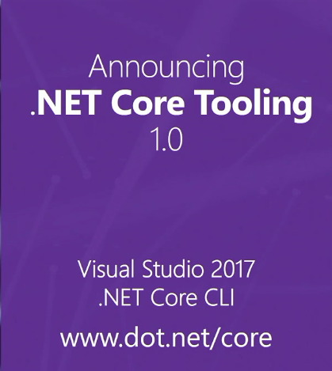
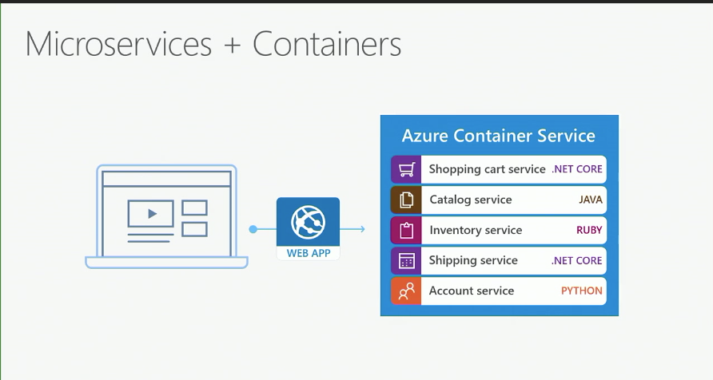

#Microsoft e Visual Studio 2017

A Microsoft tem mudado desde a entrada do novo CEO da empresa. Uma dessas mudanças atendeu ao pedido de muitos desenvolvedores e programadores, desenvolver usando ótimas ferramentas para qualquer plataforma e sistema operacional incluindo *mobile*.

Dia 07 e dia 08 a Microsoft está apresentando a nova ferramenta chamada Visual Studio 2017 completando 20 anos e no início do vídeo mostra um pouco da história.

Figura 1 - Ferramentas para .NET Core

A Microsoft anunciou novas ferramentas para o .NET Core usando Visual Studio 2017 no endereço [www.dot.net/core](http://www.dot.net/core) para várias plataformas, Windows, Mac e Linux.

Agora existe também o conceito Microservices onde você pode ter um *Web Site* com micro-serviços e cada um em diversas plataformas ou linguagens de *software*. Você já imaginou ter isso em todo seu sistema? Note que tem Ruby, Java, Python, e .NET Core.

Figura 2 - Microservices

A versão 2017 está em Beta e pode ser baixada na versão trial por 60 dias gratuitamente neste link [https://www.visualstudio.com/downloads/](https://www.visualstudio.com/downloads/) para Windows para deixar bem claro.

Ainda não sei quando vai sair a versão compatível com as outras plataformas mas você pode entrar no link [www.dot.net](http://www.dot.net) para ver a ferramenta.